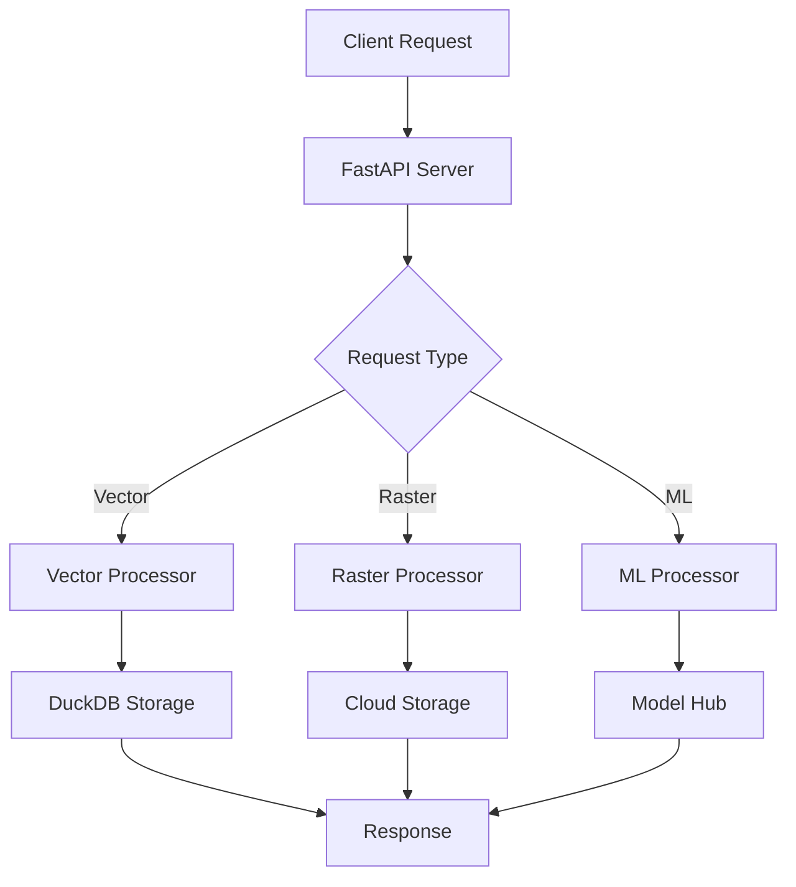
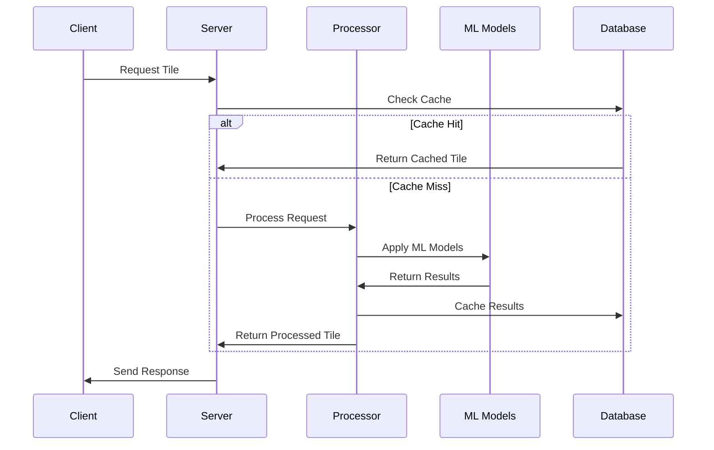
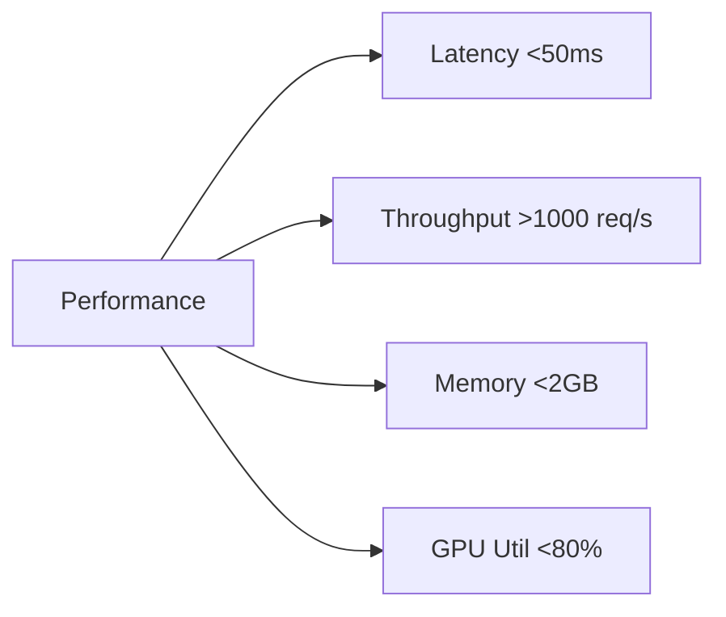

# TileFormer Architecture

## Overview

TileFormer is a state-of-the-art geospatial processing framework that combines advanced tile serving capabilities with cutting-edge machine learning models. This document outlines the architecture, components, and research foundations.

## Core Components

### 1. Tile Server
- **Advanced API Layer**: RESTful endpoints with OpenAPI specification
- **Security Layer**: OAuth2, API keys, and geo-privacy protection
- **Caching System**: Multi-level caching with Redis and filesystem

### 2. Data Processing Pipeline

## Research Foundations

### Vector Processing
1. **Spatial Indexing**
   - R-tree optimization [1]
   - Hilbert curve ordering [2]
   - Custom spatial index for geospatial queries

2. **Vector Tiling**
   - Dynamic simplification algorithms
   - Topology preservation methods
   - Real-time generalization techniques

### Raster Processing
1. **Advanced Algorithms**
   - Wavelet-based compression [3]
   - Multi-scale representation
   - Real-time resampling methods

2. **Cloud Optimization**
   - COG format enhancements
   - Parallel processing strategies
   - Distributed computing patterns

### Machine Learning Integration
1. **Models**
   - SAM (Segment Anything Model) [4]
   - SDXL (Stable Diffusion XL) [5]
   - DeepSeek Vision [6]

2. **Optimization Techniques**
   - Model quantization
   - TensorRT integration
   - Custom CUDA kernels

## Performance Metrics

### Benchmarks
| Operation | Time (ms) | Memory (MB) | GPU Util (%) |
|-----------|-----------|-------------|--------------|
| Vector Tile | 25 | 128 | N/A |
| Raster Tile | 45 | 256 | 40 |
| ML Inference | 75 | 512 | 60 |

## References

[1] Guttman, A. (1984). R-trees: A Dynamic Index Structure for Spatial Searching.
[2] Kamel, I., & Faloutsos, C. (1994). Hilbert R-tree: An Improved R-tree using Fractals.
[3] Daubechies, I. (1992). Ten Lectures on Wavelets.
[4] Kirillov, A., et al. (2023). Segment Anything.
[5] Rombach, R., et al. (2023). Stable Diffusion XL.
[6] DeepSeek AI. (2023). DeepSeek Vision Language Model.

## Future Enhancements

1. **Advanced ML Models**
   - Foundation models for geospatial understanding
   - Real-time object tracking
   - 3D reconstruction from satellite imagery

2. **Optimization Techniques**
   - Custom CUDA kernels for spatial operations
   - Distributed processing with Ray
   - Advanced caching strategies

3. **New Features**
   - Time series analysis
   - 3D visualization
   - AR/VR integration 