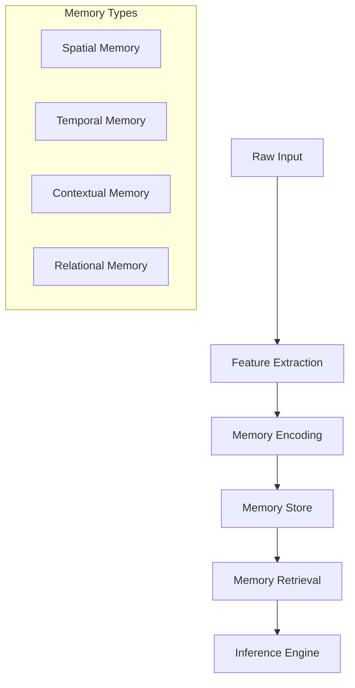

# AGI Memory & Inference Systems

## Memory Architecture

### Multi-Modal Memory Formation


### Memory Components

#### 1. Spatial Memory
- **Resolution Hierarchy**: Multi-scale representation from global to local
- **Geometric Relationships**: Topological and metric spatial relationships
- **Feature Maps**: Dense feature representations of spatial attributes
- **Attention Mechanisms**: Location-based attention for memory access

#### 2. Temporal Memory
- **Time Series Encoding**: Multi-resolution temporal encoding
- **Event Sequences**: Causal and temporal relationship tracking
- **Pattern Recognition**: Temporal pattern extraction and prediction
- **Change Detection**: Temporal difference analysis

#### 3. Contextual Memory
- **Environmental Context**: Climate, weather, and environmental conditions
- **Social Context**: Human activity and infrastructure patterns
- **Historical Context**: Past events and changes
- **Semantic Context**: Named entities and relationships

#### 4. Relational Memory
- **Entity Relationships**: Connections between spatial elements
- **Causal Networks**: Cause-effect relationships in Earth systems
- **Hierarchical Structure**: Multi-level organization of memories
- **Cross-Modal Links**: Connections across different data types

## Inference System

### Inference Architecture
```python
class InferenceEngine:
    def __init__(self):
        self.memory_store = MemoryStore()
        self.models = {
            'spatial': SpatialInference(),
            'temporal': TemporalInference(),
            'contextual': ContextualInference(),
            'relational': RelationalInference()
        }
    
    def infer(self, query, context):
        # Retrieve relevant memories
        memories = self.memory_store.retrieve(
            query=query,
            context=context,
            modalities=['spatial', 'temporal', 'contextual']
        )
        
        # Multi-model inference
        results = []
        for model_name, model in self.models.items():
            inference = model.process(
                memories=memories,
                query=query,
                context=context
            )
            results.append(inference)
            
        # Synthesize results
        return self.synthesize_results(results)
```

### Inference Capabilities

#### 1. Spatial Inference
- Pattern recognition in spatial distributions
- Topology and geometry analysis
- Spatial relationship discovery
- Location-based prediction

#### 2. Temporal Inference
- Time series forecasting
- Event sequence prediction
- Trend analysis and extrapolation
- Temporal anomaly detection

#### 3. Contextual Inference
- Multi-modal context integration
- Environmental impact analysis
- Social pattern recognition
- Semantic relationship inference

#### 4. Relational Inference
- Causal relationship discovery
- Network analysis and prediction
- Hierarchical pattern recognition
- Cross-modal relationship inference

## Memory Optimization

### Performance Enhancements

#### 1. Memory Indexing
```python
class MemoryIndex:
    def __init__(self):
        self.spatial_index = RTree()
        self.temporal_index = TimeSeries()
        self.semantic_index = HNSW()
        
    def index_memory(self, memory):
        # Spatial indexing
        spatial_features = memory.get_spatial_features()
        self.spatial_index.insert(
            id=memory.id,
            bounds=spatial_features.bounds
        )
        
        # Temporal indexing
        temporal_features = memory.get_temporal_features()
        self.temporal_index.insert(
            timestamp=temporal_features.timestamp,
            data=memory.id
        )
        
        # Semantic indexing
        semantic_features = memory.get_semantic_features()
        self.semantic_index.add_item(
            memory.id,
            semantic_features.vector
        )
```

#### 2. Memory Compression
- Hierarchical feature compression
- Importance-based retention
- Redundancy elimination
- Progressive loading

#### 3. Distributed Processing
- Parallel memory retrieval
- Distributed inference
- Load balancing
- Cache optimization

## Memory Quality Metrics

### Evaluation Framework

#### 1. Accuracy Metrics
- Spatial precision and recall
- Temporal alignment score
- Contextual relevance
- Relationship accuracy

#### 2. Performance Metrics
- Memory retrieval latency
- Inference speed
- Resource utilization
- Scalability measures

#### 3. Quality Metrics
- Memory coherence
- Information preservation
- Noise resistance
- Generalization capability

## Best Practices

### Memory System Design

1. **Modular Architecture**
   - Separate concerns for different memory types
   - Pluggable inference models
   - Extensible indexing system
   - Flexible retrieval mechanisms

2. **Optimization Strategy**
   - Progressive memory loading
   - Intelligent caching
   - Distributed processing
   - Resource management

3. **Quality Assurance**
   - Continuous evaluation
   - Performance monitoring
   - Error analysis
   - Improvement tracking

### Implementation Guidelines

1. **Memory Formation**
   ```python
   def form_memory(data, context):
       # Extract features
       spatial_features = extract_spatial(data)
       temporal_features = extract_temporal(data)
       contextual_features = extract_context(context)
       
       # Encode memory
       memory = Memory(
           spatial=spatial_features,
           temporal=temporal_features,
           contextual=contextual_features
       )
       
       # Index and store
       memory_store.index(memory)
       memory_store.save(memory)
       
       return memory
   ```

2. **Memory Retrieval**
   ```python
   def retrieve_memories(query, context):
       # Parse query
       spatial_query = parse_spatial(query)
       temporal_query = parse_temporal(query)
       contextual_query = parse_context(query)
       
       # Multi-index search
       candidates = memory_store.search(
           spatial=spatial_query,
           temporal=temporal_query,
           contextual=contextual_query
       )
       
       # Rank and filter
       relevant_memories = rank_memories(
           candidates,
           query=query,
           context=context
       )
       
       return relevant_memories
   ```

## Advanced Topics

### Memory Evolution

1. **Adaptive Memory**
   - Dynamic feature importance
   - Context-dependent compression
   - Automatic memory pruning
   - Incremental learning

2. **Memory Synthesis**
   - Cross-modal memory generation
   - Pattern-based synthesis
   - Counterfactual memories
   - Scenario simulation

3. **Memory Analysis**
   - Pattern discovery
   - Anomaly detection
   - Trend analysis
   - Relationship mining

### Future Directions

1. **Research Areas**
   - Improved memory compression
   - Advanced inference models
   - Real-time processing
   - Scalability enhancements

2. **Development Roadmap**
   - Enhanced memory indexing
   - Distributed architecture
   - Advanced visualization
   - API improvements 