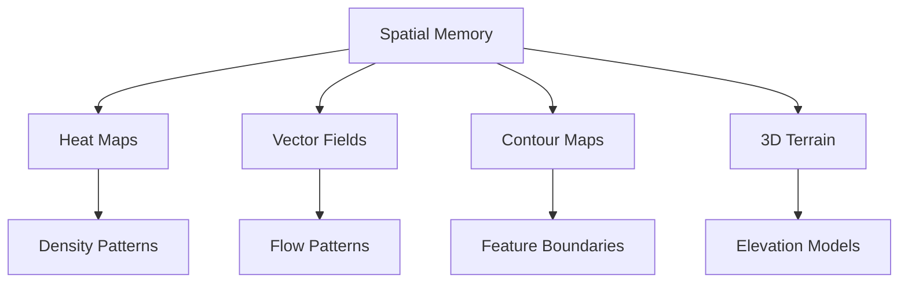
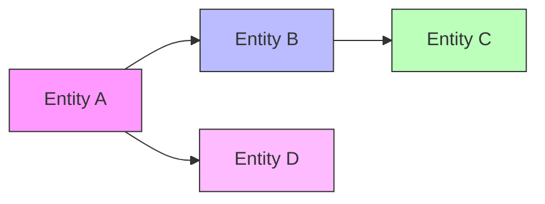

# Inference Results Visualization Guide

## Overview

This guide provides comprehensive information on visualizing and interpreting inference results from the AGI memory system. It covers various visualization techniques, interpretation strategies, and best practices for understanding complex inference patterns.

## Visualization Types

### 1. Spatial Memory Visualization



#### Implementation Example
```python
def visualize_spatial_memory(memory_data):
    """
    Create multi-layer spatial visualization
    
    Args:
        memory_data: Spatial memory data
        
    Returns:
        Figure with multiple visualization layers
    """
    fig = plt.figure(figsize=(12, 8))
    
    # Heat map layer
    ax1 = fig.add_subplot(221)
    sns.heatmap(memory_data.density, cmap='viridis')
    
    # Vector field layer
    ax2 = fig.add_subplot(222)
    plt.quiver(memory_data.flow_x, memory_data.flow_y)
    
    # Contour map layer
    ax3 = fig.add_subplot(223)
    plt.contour(memory_data.features)
    
    # 3D terrain layer
    ax4 = fig.add_subplot(224, projection='3d')
    ax4.plot_surface(memory_data.elevation)
    
    return fig
```

### 2. Temporal Pattern Visualization

#### Time Series Analysis
```python
def plot_temporal_patterns(time_series_data):
    """
    Visualize temporal patterns and trends
    
    Args:
        time_series_data: Time series memory data
        
    Returns:
        Multiple time series visualizations
    """
    fig = plt.figure(figsize=(15, 10))
    
    # Raw time series
    ax1 = fig.add_subplot(311)
    ax1.plot(time_series_data.timestamps, time_series_data.values)
    
    # Trend decomposition
    ax2 = fig.add_subplot(312)
    decomposition = seasonal_decompose(time_series_data)
    ax2.plot(decomposition.trend)
    
    # Anomaly detection
    ax3 = fig.add_subplot(313)
    anomalies = detect_anomalies(time_series_data)
    ax3.scatter(anomalies.timestamps, anomalies.values, c='red')
    
    return fig
```

### 3. Relationship Network Visualization



#### Network Analysis
```python
def visualize_relationships(network_data):
    """
    Create interactive network visualization
    
    Args:
        network_data: Network relationship data
        
    Returns:
        Interactive network graph
    """
    G = nx.from_pandas_edgelist(network_data)
    
    # Calculate network metrics
    centrality = nx.betweenness_centrality(G)
    communities = community.best_partition(G)
    
    # Create interactive visualization
    net = Network(height='750px', width='100%')
    
    for node in G.nodes():
        net.add_node(
            node,
            value=centrality[node],
            group=communities[node],
            title=f"Node: {node}\nCentrality: {centrality[node]:.2f}"
        )
    
    for edge in G.edges():
        net.add_edge(edge[0], edge[1])
    
    return net
```

## Interpretation Guidelines

### 1. Pattern Recognition

#### Spatial Patterns
- Cluster identification
- Boundary detection
- Density analysis
- Flow patterns

#### Temporal Patterns
- Trend analysis
- Seasonality detection
- Anomaly identification
- Pattern prediction

#### Relationship Patterns
- Community detection
- Centrality analysis
- Path analysis
- Influence propagation

### 2. Inference Quality Assessment

#### Metrics Dashboard
```python
def create_inference_dashboard(inference_results):
    """
    Generate comprehensive inference quality dashboard
    
    Args:
        inference_results: Inference output data
        
    Returns:
        Dashboard visualization
    """
    dashboard = Dashboard()
    
    # Accuracy metrics
    dashboard.add_panel(
        plot_accuracy_metrics(inference_results.accuracy)
    )
    
    # Confidence scores
    dashboard.add_panel(
        plot_confidence_distribution(inference_results.confidence)
    )
    
    # Error analysis
    dashboard.add_panel(
        plot_error_patterns(inference_results.errors)
    )
    
    # Performance metrics
    dashboard.add_panel(
        plot_performance_metrics(inference_results.performance)
    )
    
    return dashboard
```

## Interactive Visualization Tools

### 1. Real-time Monitoring

```python
class InferenceMonitor:
    def __init__(self):
        self.fig = plt.figure(figsize=(12, 8))
        self.animation = FuncAnimation(
            self.fig,
            self.update,
            interval=1000
        )
    
    def update(self, frame):
        # Update spatial visualization
        self.update_spatial()
        
        # Update temporal patterns
        self.update_temporal()
        
        # Update network visualization
        self.update_network()
        
        # Update metrics
        self.update_metrics()
```

### 2. User Interaction

```python
class InteractiveVisualizer:
    def __init__(self):
        self.app = dash.Dash(__name__)
        self.setup_layout()
        
    def setup_layout(self):
        self.app.layout = html.Div([
            # Control panel
            html.Div([
                dcc.Dropdown(
                    id='visualization-type',
                    options=[
                        {'label': 'Spatial', 'value': 'spatial'},
                        {'label': 'Temporal', 'value': 'temporal'},
                        {'label': 'Network', 'value': 'network'}
                    ]
                ),
                dcc.RangeSlider(
                    id='time-range',
                    min=0,
                    max=100,
                    step=1
                ),
                dcc.Checklist(
                    id='layer-selection',
                    options=[
                        {'label': 'Heat Map', 'value': 'heat'},
                        {'label': 'Vector Field', 'value': 'vector'},
                        {'label': 'Contours', 'value': 'contour'}
                    ]
                )
            ]),
            
            # Visualization area
            html.Div([
                dcc.Graph(id='main-visualization')
            ])
        ])
```

## Best Practices

### 1. Visual Design

- Use consistent color schemes
- Implement clear labeling
- Provide interactive legends
- Maintain appropriate scale

### 2. Performance Optimization

```python
def optimize_visualization(data, max_points=1000):
    """
    Optimize visualization for large datasets
    
    Args:
        data: Input data
        max_points: Maximum points to display
        
    Returns:
        Optimized data for visualization
    """
    if len(data) > max_points:
        # Implement data reduction strategies
        reduced_data = reduce_resolution(data, max_points)
        return reduced_data
    return data
```

### 3. Accessibility

- Support multiple color modes
- Implement keyboard navigation
- Provide alternative text
- Enable data export

## Advanced Features

### 1. Comparative Analysis

```python
def compare_inference_results(result1, result2):
    """
    Create comparative visualization of inference results
    
    Args:
        result1: First inference result
        result2: Second inference result
        
    Returns:
        Comparative visualization
    """
    fig = plt.figure(figsize=(15, 10))
    
    # Difference maps
    ax1 = fig.add_subplot(221)
    plot_difference_map(result1, result2)
    
    # Statistical comparison
    ax2 = fig.add_subplot(222)
    plot_statistical_comparison(result1, result2)
    
    # Performance comparison
    ax3 = fig.add_subplot(223)
    plot_performance_comparison(result1, result2)
    
    # Quality metrics
    ax4 = fig.add_subplot(224)
    plot_quality_comparison(result1, result2)
    
    return fig
```

### 2. Export Capabilities

```python
class VisualizationExporter:
    def __init__(self):
        self.supported_formats = ['png', 'svg', 'html', 'pdf']
    
    def export(self, visualization, format='png', path=None):
        """
        Export visualization in specified format
        
        Args:
            visualization: Visualization object
            format: Export format
            path: Export path
            
        Returns:
            Export status
        """
        if format not in self.supported_formats:
            raise ValueError(f"Unsupported format: {format}")
            
        if format == 'html':
            return self.export_interactive(visualization, path)
        else:
            return self.export_static(visualization, format, path)
```

## Future Enhancements

### 1. Advanced Visualization Types
- Virtual reality integration
- Augmented reality overlay
- Holographic display
- Multi-dimensional visualization

### 2. AI-Assisted Interpretation
- Automated pattern detection
- Intelligent anomaly highlighting
- Context-aware explanations
- Predictive insights

### 3. Collaborative Features
- Real-time sharing
- Multi-user interaction
- Version control
- Annotation system 