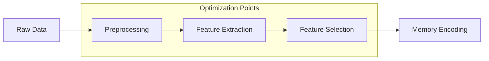

# Memory System Performance Guide

## Overview

This guide focuses on optimizing the performance of the AGI memory system, covering memory formation, retrieval, and inference optimization techniques. It provides detailed strategies for improving system efficiency while maintaining high accuracy.

## Memory Formation Optimization

### 1. Feature Extraction Pipeline



#### Implementation
```python
class OptimizedFeatureExtractor:
    def __init__(self):
        self.preprocessor = CachedPreprocessor()
        self.feature_extractor = ParallelExtractor()
        self.feature_selector = AdaptiveSelector()
        
    def extract_features(self, data):
        """
        Optimized feature extraction pipeline
        
        Args:
            data: Raw input data
            
        Returns:
            Optimized feature set
        """
        # Cached preprocessing
        preprocessed = self.preprocessor.process(
            data,
            cache_key=hash(data)
        )
        
        # Parallel feature extraction
        features = self.feature_extractor.extract_parallel(
            preprocessed,
            n_jobs=-1
        )
        
        # Adaptive feature selection
        selected = self.feature_selector.select(
            features,
            importance_threshold=0.1
        )
        
        return selected
```

### 2. Memory Compression

#### Adaptive Compression
```python
class AdaptiveCompressor:
    def __init__(self):
        self.compressors = {
            'spatial': SpatialCompressor(),
            'temporal': TemporalCompressor(),
            'semantic': SemanticCompressor()
        }
        
    def compress(self, memory_data, mode='auto'):
        """
        Compress memory data with adaptive strategy
        
        Args:
            memory_data: Input memory data
            mode: Compression mode
            
        Returns:
            Compressed memory data
        """
        if mode == 'auto':
            mode = self.select_compression_mode(memory_data)
            
        compressor = self.compressors[mode]
        return compressor.compress(
            memory_data,
            quality_threshold=0.95
        )
```

## Memory Retrieval Optimization

### 1. Index Optimization

#### Multi-Level Index
```python
class OptimizedMemoryIndex:
    def __init__(self):
        self.l1_cache = LRUCache(maxsize=1000)
        self.l2_index = LSHIndex()
        self.l3_index = ExactIndex()
        
    def query(self, query_vector, top_k=10):
        """
        Multi-level index query
        
        Args:
            query_vector: Query vector
            top_k: Number of results
            
        Returns:
            Top-k results
        """
        # Check L1 cache
        cache_key = self._compute_cache_key(query_vector)
        if cache_key in self.l1_cache:
            return self.l1_cache[cache_key]
            
        # L2 approximate search
        candidates = self.l2_index.query(
            query_vector,
            n_candidates=top_k * 2
        )
        
        # L3 exact refinement
        results = self.l3_index.refine(
            candidates,
            query_vector,
            top_k=top_k
        )
        
        # Update cache
        self.l1_cache[cache_key] = results
        return results
```

### 2. Batch Processing

```python
class BatchProcessor:
    def __init__(self, batch_size=32):
        self.batch_size = batch_size
        self.queue = Queue()
        self.results = {}
        
    def process_batch(self, queries):
        """
        Process queries in batches
        
        Args:
            queries: List of queries
            
        Returns:
            Batch results
        """
        batches = self._create_batches(queries)
        
        with ThreadPoolExecutor() as executor:
            futures = []
            for batch in batches:
                future = executor.submit(
                    self._process_single_batch,
                    batch
                )
                futures.append(future)
                
        results = [f.result() for f in futures]
        return self._merge_results(results)
```

## Inference Optimization

### 1. Model Optimization

#### Model Quantization
```python
def quantize_model(model, quantization_config):
    """
    Quantize inference model
    
    Args:
        model: Original model
        quantization_config: Quantization parameters
        
    Returns:
        Quantized model
    """
    # Dynamic range quantization
    quantized = torch.quantization.quantize_dynamic(
        model,
        {torch.nn.Linear},
        dtype=torch.qint8
    )
    
    # Calibrate quantization
    calibrate_model(quantized, calibration_data)
    
    return quantized
```

### 2. Inference Pipeline

```python
class OptimizedInferencePipeline:
    def __init__(self):
        self.memory_cache = MemoryCache()
        self.model = QuantizedModel()
        self.post_processor = BatchPostProcessor()
        
    def infer(self, queries, batch_size=32):
        """
        Optimized inference pipeline
        
        Args:
            queries: Input queries
            batch_size: Batch size
            
        Returns:
            Inference results
        """
        # Cache check
        cached_results = self.memory_cache.get_many(queries)
        missing_queries = [q for q in queries if q not in cached_results]
        
        if missing_queries:
            # Batch processing
            batches = create_batches(missing_queries, batch_size)
            batch_results = []
            
            for batch in batches:
                # Model inference
                features = self.model.extract_features(batch)
                predictions = self.model.predict(features)
                processed = self.post_processor.process(predictions)
                batch_results.extend(processed)
                
            # Update cache
            self.memory_cache.update_many(
                zip(missing_queries, batch_results)
            )
            
            # Merge results
            cached_results.update(dict(zip(missing_queries, batch_results)))
            
        return [cached_results[q] for q in queries]
```

## Performance Monitoring

### 1. Metrics Collection

```python
class PerformanceMonitor:
    def __init__(self):
        self.metrics = defaultdict(list)
        self.start_time = time.time()
        
    def record_metric(self, name, value):
        """
        Record performance metric
        
        Args:
            name: Metric name
            value: Metric value
        """
        self.metrics[name].append({
            'value': value,
            'timestamp': time.time() - self.start_time
        })
        
    def get_statistics(self, name):
        """
        Get metric statistics
        
        Args:
            name: Metric name
            
        Returns:
            Metric statistics
        """
        values = [m['value'] for m in self.metrics[name]]
        return {
            'mean': np.mean(values),
            'std': np.std(values),
            'min': np.min(values),
            'max': np.max(values),
            'count': len(values)
        }
```

### 2. Performance Analysis

```python
class PerformanceAnalyzer:
    def __init__(self):
        self.monitor = PerformanceMonitor()
        self.thresholds = load_thresholds()
        
    def analyze_performance(self):
        """
        Analyze system performance
        
        Returns:
            Performance analysis report
        """
        report = {}
        
        # Memory metrics
        report['memory'] = self.analyze_memory_metrics()
        
        # Retrieval metrics
        report['retrieval'] = self.analyze_retrieval_metrics()
        
        # Inference metrics
        report['inference'] = self.analyze_inference_metrics()
        
        # Generate recommendations
        report['recommendations'] = self.generate_recommendations(report)
        
        return report
```

## Best Practices

### 1. Memory Management

- Implement proper memory cleanup
- Use memory-mapped files for large datasets
- Monitor memory usage patterns
- Implement automatic garbage collection

### 2. Caching Strategy

- Use multi-level caching
- Implement cache warming
- Set appropriate cache sizes
- Monitor cache hit rates

### 3. Resource Allocation

- Balance CPU and GPU usage
- Optimize thread pool sizes
- Monitor I/O operations
- Implement resource limits

## Advanced Optimization

### 1. Distributed Processing

```python
class DistributedProcessor:
    def __init__(self, num_workers=4):
        self.num_workers = num_workers
        self.task_queue = Queue()
        self.result_queue = Queue()
        
    def process_distributed(self, tasks):
        """
        Process tasks in distributed manner
        
        Args:
            tasks: List of tasks
            
        Returns:
            Processed results
        """
        # Distribute tasks
        for task in tasks:
            self.task_queue.put(task)
            
        # Create workers
        workers = []
        for _ in range(self.num_workers):
            worker = Worker(
                task_queue=self.task_queue,
                result_queue=self.result_queue
            )
            workers.append(worker)
            worker.start()
            
        # Collect results
        results = []
        for _ in range(len(tasks)):
            result = self.result_queue.get()
            results.append(result)
            
        return results
```

### 2. Hardware Acceleration

```python
class AcceleratedProcessor:
    def __init__(self):
        self.device = torch.device('cuda' if torch.cuda.is_available() else 'cpu')
        self.model = self.model.to(self.device)
        
    def process_batch(self, batch):
        """
        Process batch with hardware acceleration
        
        Args:
            batch: Input batch
            
        Returns:
            Processed results
        """
        # Move to device
        batch = batch.to(self.device)
        
        # Process with acceleration
        with torch.cuda.amp.autocast():
            results = self.model(batch)
            
        # Move back to CPU
        results = results.cpu()
        
        return results
```

## Future Optimizations

### 1. Research Areas
- Neural architecture search
- Automated optimization
- Dynamic resource allocation
- Advanced caching strategies

### 2. Development Roadmap
- Implement distributed training
- Enhance model compression
- Improve memory efficiency
- Optimize inference pipeline 